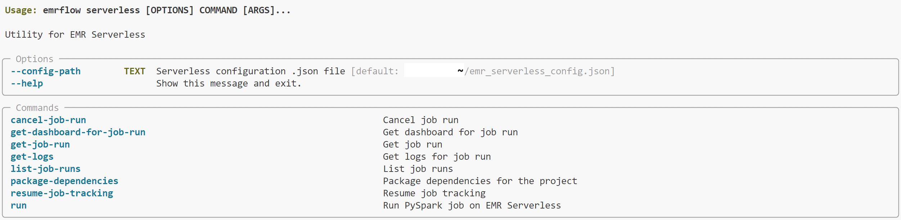
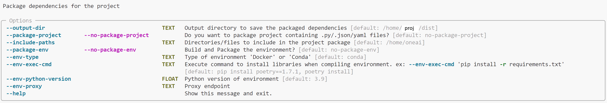
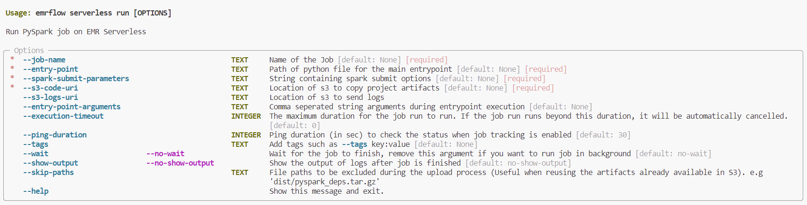
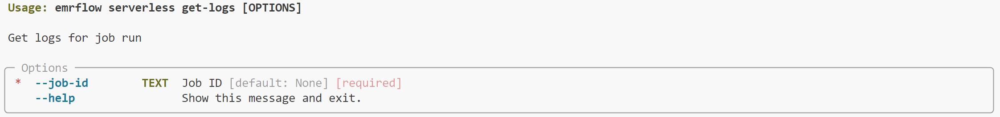

# EMRFlow :cyclone:


<span style="color:purple;">**EMRFlow** </span> is designed to simplify the process of running PySpark jobs on [Amazon EMR](https://aws.amazon.com/emr/) (Elastic Map Reduce). It abstracts the complexities of interacting with EMR APIs and provides an intuitive command-line interface and python library to effortlessly submit, monitor, and list your EMR PySpark jobs.

<span style="color:purple;">**EMRFlow** </span> serves as both a library and a command-line tool.

To install `EMRFlow`, please run:

```bash
pip install emrflow
```
## Configuration

Create an `emr_serverless_config.json` file containing the specified details and store it in your home directory
```json
{
    "application_id": "",
    "job_role": "",
    "region": ""
}
```

## Usage
Please read the [GETTING STARTED](GETTING_STARTED.md) to integrate <span style="color:purple;">**EMRFlow** </span> into your project.

<span style="color:purple;">**EMRFlow** </span> offers several commands to manage your Pypark jobs. Let's explore some key functionalities:


### Help
```bash
emrflow serverless --help
```



### Package Dependencies

You will need to package dependencies before running an EMR job if you have external libraries needing to be installed or local imports from your code base. See Scenario 2-4 in [GETTING STARTED](GETTING_STARTED.md).
```bash
emrflow serverless package-dependencies --help
```



### Submit PySpark Job
```bash
emrflow serverless run --help
```

```bash
emrflow serverless run \
        --job-name "<job-name>" \
        --entry-point "<location-of-main-python-file>" \
        --spark-submit-parameters " --conf spark.executor.cores=8 \
                                    --conf spark.executor.memory=32g \
                                    --conf spark.driver.cores=8 \
                                    --conf spark.driver.memory=32g \
                                    --conf spark.dynamicAllocation.maxExecutors=100" \
        --s3-code-uri "s3://<emr-s3-path>" \
        --s3-logs-uri "s3://<emr-s3-path>/logs" \
        --execution-timeout 0 \
        --ping-duration 60 \
        --wait \
        --show-output
```


### List Previous Runs
```bash
emrflow serverless list-job-runs --help
```

### Get Logs of Previous Runs
```bash
emrflow serverless get-logs --help
```



## Use EMRFlow as an API
```Python
import os
from emrflow import emr_serverless

# initialize connection
emr_serverless.init_connection()

# submit job to EMR Serverless
emr_job_id = emr_serverless.run(
    job_name="<job-name>",
    entry_point="<location-of-main-python-file>",
    spark_submit_parameters="--conf spark.executor.cores=8 \
                            --conf spark.executor.memory=32g \
                            --conf spark.driver.cores=8 \
                            --conf spark.driver.memory=32g \
                            --conf spark.dynamicAllocation.maxExecutors=100",
    wait=True,
    show_output=True,
    s3_code_uri="s3://<emr-s3-path>",
    s3_logs_uri="s3://<emr-s3-path>/logs",
    execution_timeout=0,
    ping_duration=60,
    tags=["env:dev"],
)
print(emr_job_id)
```


**And so much more.......!!!**


## Contributing

We welcome contributions to EMRFlow. Please open an issue discussing the change you would like to see. Create a feature branch to work on that issue and open a Pull Request once it is ready for review.

### Code style

We use [black](https://black.readthedocs.io/en/stable/) as a code formatter. The easiest way to ensure your commits are always formatted with the correct version of `black` it is to use [pre-commit](https://pre-commit.com/): install it and then run `pre-commit install` once in your local copy of the repo.
